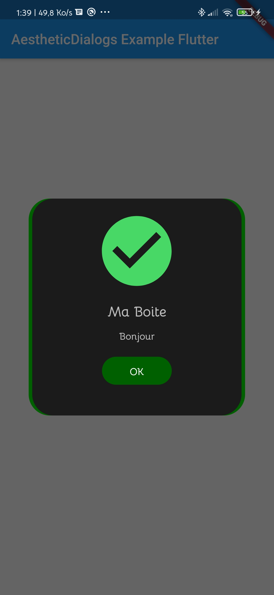

# AestheticDialogs

AestheticDialogs is inspired by [Laravel Notify](https://github.com/mckenziearts/laravel-notify)
This Flutter plugin allows you to display nice custom dialog boxes. It is only available on Android at the moment.

Android Version : [AestheticDialogs](https://github.com/gabriel-TheCode/AestheticDialogs)




## Install
Kotlin version : minimum 1.3.40

AestheticDialog use AppCompat Themes

Add the dependency

```gradle
dependencies {
	...
	implementation 'androidx.appcompat:appcompat:1.2.0'
}
```

Follow the instructions to integrate a package into your Flutter application.
Make sure you also use the AppCompat themes :
 - Download the [colors.xml](https://github.com/BorisGautier/aestheticDialogs/blob/master/example/android/app/src/main/res/values/colors.xml) file and paste it into your project: "/android/app/src/main/res/values/".
 - Download the [styles.xml](https://github.com/BorisGautier/aestheticDialogs/blob/master/example/android/app/src/main/res/values/styles.xml) file and replace it into your project: "/android/app/src/main/res/values/".
### How to use it?

```dart
import 'package:AestheticDialogs/AestheticDialogs.dart';

...

AestheticDialogs.showDialog(
        title: "Ma Boite",
        message: "Bonjour",
        cancelable: true,
        darkMode: false,
        dialogAnimation: DialogAnimation.IN_OUT,
        dialogGravity: DialogGravity.CENTER,
        dialogStyle: DialogStyle.EMOJI,
        dialogType: DialogType.INFO,
        duration: 3000);
```
The time is expressed in milliseconds and by default it is 3000ms.
A more complete example can be found in the "example" folder of the Git repository.

## Types of Dialog
**AestheticDialog** At this moment, library provides eight types of dialog i.e.

<table style="width:100%">
  <tr>
    <th>1. Flash Dialog</th>
    <th>2. Connectify Dialog</th>
    <th>3. Toaster Dialog</th>
  </tr>
  <tr>
    <td></td>
    <td></td>
    <td></td>
  </tr>
  <tr>
    <th>4. Emotion Dialog</th>
    <th>5. Drake Dialog</th>
    <th>6. Emoji Dialog</th>
  </tr>
  <tr>
    <td></td>
    <td></td>
    <td></td>
  </tr>

   <tr>
    <th>7. Rainbow Dialog</th>
    <th>8. Flat Dialog</th>
  </tr>

   <tr>
    <th></th>
    <td></td>

  </tr>
</table>

<a name="dark"></a>
## Dark Mode
**AestheticDialog** Also provides Dark Theme for some dialogs i.e.

<table style="width:100%">
  <tr>
    <th>1. Connectify Dark Dialog</th>
    <th>2. Toaster Dark Dialog</th>
    <th>3. Emoji Dark Dialog</th>
  </tr>
  <tr>
    <td></td>
    <td></td>
     <td></td>
  </tr>
  <tr>
    <th>4. Flat Dark Dialog</th>
    <th colspan="2">LET's USE aesthetic Dialog !</th>
    <tr>
    <td></td>

  </tr>
  </tr>
</table>

**Constants**

<table style="width:100%">
  <tr>
    <th>DIALOG STYLE</th>
    <th>DIALOG TYPE</th>
    <th>DIALOG ANIMATION</th>
  </tr>
  <tr>
    <td>RAINBOW<br/>FLAT<br/>CONNECTIFY<br/>TOASTER<br/>DRAKE<br/>EMOJI<br/>EMOTION<br/>
    </td>
    <td>SUCCESS<br/>ERROR<br/>WARNING<br/>INFO</td>
     <td>DEFAULT<br/>SLIDE_UP, SLIDE_DOWN<br/>SLIDE_LEFT, SLIDE_RIGHT<br/> SWIPE_LEFT, SWIPE_RIGHT<br/>IN_OUT<br/>CARD<br/> SHRINK<br/>SPLIT<br/>DIAGONAL<br/>SPIN<br/>WINDMILL<br/>FADE<br/>ZOOM</td>
  </tr>
</table>


<a name="demo"></a>
## Demo
You can download the demo app on [PlayStore](https://play.google.com/store/apps/details?id=com.thecode.sample)

<a name="contribute"></a>
## Contribute

You can contribute us by filing issues, bugs and PRs.

### Contributing:
- Open issue regarding proposed change.
- Repo owner will contact you there.
- If your proposed change is approved, Fork this repo and do changes.
- Open PR against latest `dev` branch. Add nice description in PR.
- You're done!

